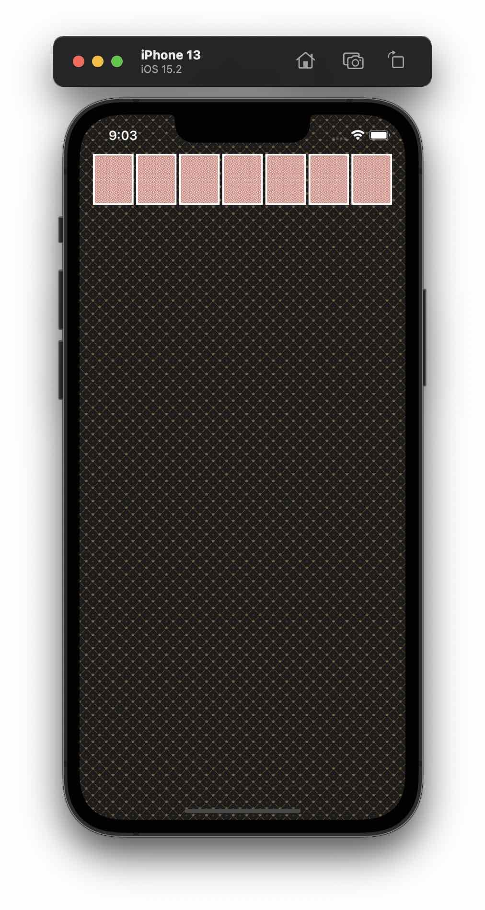
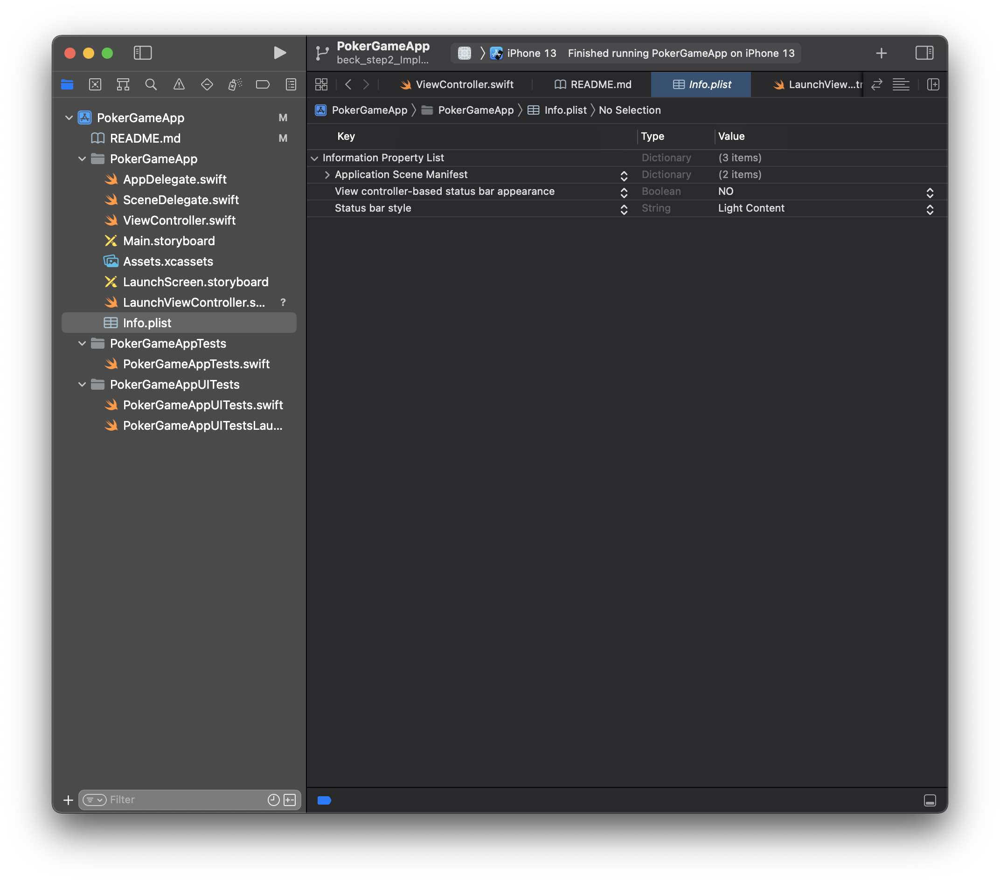
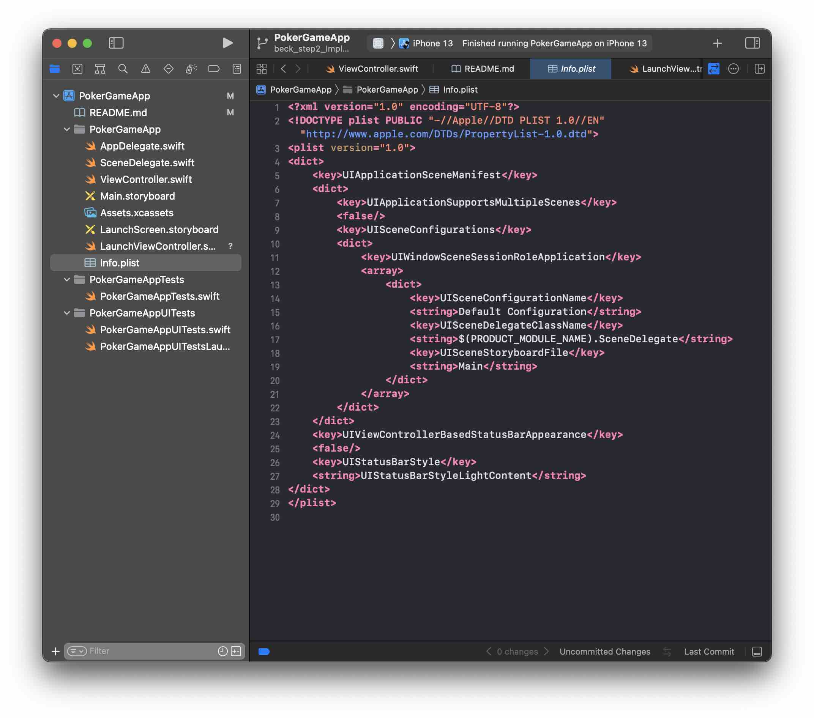

# swift-pokergame

# step1 (2022/2/21 20시 완료)

- [x] 앱 기본 설정을 지정해서 StatusBar 스타일을 LightContent로 보이도록 한다.
- [x] ViewController 클래스에서 self.view 배경을 다음 이미지 패턴으로 지정한다. 이미지 파일은 Assets에 추가한다.
- [x] 다음 카드 뒷면 이미지를 다운로드해서 프로젝트 Assets.xcassets에 추가한다.
- [x] ViewController 클래스에서 코드로 7개 UIImageView를 생성하고, 추가해서 카드 뒷면을 보여준다.
- [x] 주의사항 우선 UIStackView를 사용하지 말고 직접 UIImageView를 7개 생성해야 한다.
- [x] (추가) UIStackView를 이용해서 직접 UIImageView를 정렬한다.
- [x] 화면 크기를 구하고 균등하게 7등분해서 이미지를 표시해야 한다
- [x] 카드 가로와 세로 비율은 1:1.27로 지정한다.
- [x] (추가) 앱 기본 설정(Info.plist)을 변경하는 방식에 대해 학습하고 앱 표시 이름을 변경한다

## 학습 내용

### 작업 내용

앱의 기본 설정값을 바꿔야 하는 경우가 있는데, 이를 바꾸는 방법에 대해 실습하기 위해 과제에 안내된 대로 StatusBar의 속성을 변경하는 방법들을 알아보았다.

각 UIViewController들이 제공하는 ```var prefferedStatusBarStyle: UIStatusBarStyle { get }```은 해당 화면에서 쉽게 StatusBar의 속성을 변하게 할 수 있는데 이는 애플의 권장사항이기도 하다.

하지만, 앱 전체의 설정을 바꾸고 싶을 때는 프로젝트 파일의 설정을 바꾸거나 Info.plist의 설정을 변경하는 방법으로 진행해도 좋다.

카드 이미지를 넣기 위해서 다음의 사고를 하였다.
1. 카드 이미지는 root view 안에 들어갈 것이므로, 이미지 폭은 root view의 폭에 맞춘다. 
2. 비율은 1:1.27로 고정이었으므로 높이는 고려하지 않는다.
3. 결과 화면에 나와있다 시피 카드 이미지는 화면의 왼쪽이나 위에 붙어있지 않고 일부 띄어져 있었다.
4. readableContentGuide 혹은 safeAreaLayoutGuide를 참고할 필요가 있다.
5. 뷰를 생성하는 과정 자체는 똑같고, 배치하는 부분이 다르기 때문에 이 둘을 한 곳에 넣을 필요 없이 함수형 프로그래밍을 이용해 분리하면 될 것 같다.



### 아쉬운 점

뷰를 생성하고 배치하는 과정에서 뷰를 생성할 때 2차원 배열을 사용하였다면, 카드를 배치하는 소스를 좀 더 간결하고 명확하게 코딩할 수 있었을 텐데 하는 아쉬움이 남는다.

역시 뷰를 배치하는 인터페이스가 필요할 때는 UIStackView가 좋은 해결책이 되어주는 것 같다.  

### 앱 기본 설정에 관하여

앱 기본 설정을 하는 방법은 크게 두 가지가 있다.

1. Info.plist(Information property list) 를 직접 설정한다.
2. Project Navigator 의 프로젝트 파일을 선택한 후 세팅값을 조절한다.   
상당히 편리하고 사람의 실수로 인한 오류를 줄여줄 수 있다. 하지만, 이전 버전과의 호환 문제가 발생할 수도 있으므로 많은 기기에서 테스트할 필요가 있다.

> (추가) Info.plist 파일은 SwiftUI 앱 템플릿에서 확인이 불가하다.




수정하는 방법은 코드로 입력하거나, 표 형식으로 된 화면에서 직접 입력하는 방법이 있다. 만약 이 파일에서 문제(예: 깃 허브 충돌 등)가 발생할 경우 직접 해결해야 한다. 코드로도 내용을 한번 확인해보는 것이 좋다고 생각한다.

Info.plist의 키-값 쌍은 아래의 링크에서 자세히 확인할 수 있다.
[About Info.plist Keys and Values(Apple Documentation Archive)](https://developer.apple.com/library/archive/documentation/General/Reference/InfoPlistKeyReference/Introduction/Introduction.html#//apple_ref/doc/uid/TP40009248-SW1)

### [class] UIImage

iOS에서 이미지 데이터를 관리하기 위해 생성하는 객체의 클래스이다.   
거의 대부분의 이미지 포맷을 처리할 수 있고(공식문서에서는 PNG 혹은 JPEG 파일을 추천한다), 한번 생성된 객체는 수정이 불가능하다.   
UIImage 클래스는 단일 이미지 표현 혹은 데이터 배열을 이용한 애니메이션 표현이 가능하다.

UIImage는 많은 곳에 사용될 수 있다.
* UIImageView가 표현할 객체로 지정될 수 있다.
* 버튼, 슬라이더 등 System controls를 커스텀하기 위해 사용할 수 있다.
* 특정 view와 같은 그래픽 컨텍스트에 이미지를 그린다.
* API에 이미지 데이터를 첨부하려고 할 때 유용하다.

UIImage 클래스를 초기화하는 방법은 크게 세 가지이다.
1. name을 이용한다.
2. 실제 저장된 file을 이용한다.
3. UIImage 클래스에 지정된 ```animatedImage(with:duration)```를 이용하면 간단한 애니메이션 효과를 줄 수 있다(예시: 와이파이 전파가 발산되는 이미지).

resizableImage는 원본 이미지를 늘이거나 줄여서 배경이미지 등으로 사용할 수 있습니다. ```resizableImage(withCapInsets:)``` ```resizableImage(withCapInsets:resizingMode:)``` 메소드를 이용할 수 있습니다. 여기서 cap이란 꼭지점을 얘기한다.

UIImage는 ```isEqual(_:)``` 메소드를 통해 비교가 가능하다. 이미지 데이터를 같은 캐시 등에서 만들어낼 수 있기 때문에 이 방법이 정확하다.

UIImgae의 데이터에 접근하는 방법은 ```cgImage```/```ciImage``` 프로퍼티를 이용하거나, ```pngData()```/```jpegData(compressionQuality:)``` 를 이용해서 실제 Data 객체에 접근할 수도 있따. 

### [class] UIImageView

위에서 언급한 UIImage를 보여줄 수 있는 객체의 클래스이다. 어떤 이미지를 '보여주느냐'에 초점이 맞춰져 있기 때문에 런타임 와중에도 이미지를 바꾸거나 조정할 수 있고, 애니메이션 효과가 들어가 있다면 그 또한 조정이 가능하다. UIImageView는 UIImage를 배경에 위치시키고

이미지를 '보여주는' 방법은 객체의 ```contentMode``` 를 조정하는 것으로 가능합니다. 거의 대부분이 이름만으로 그 의미를 파악할 수 있지만 특이한 것 네 가지만 따로 소개한다.

| 이름              | 의미                                                                                |
|-----------------|-----------------------------------------------------------------------------------|
| scaleToFill     | 이미지를 UIImageView의 view 크기에 맞춰서 비율을 조정한다. 이미지가 찌그러져 보일 수도 있다.                      |
| scaleAspectFit  | 이미지를 UIImageView의 view크기에 맞추기 위해 크기를 조정하지만, 그 비율은 유지한다. 이미지가 찌그러지지 않는다.           |
| scaleAspectFill | 이미지를 UIImageView의 view크기에 맞추기 위해 크기를 늘인다. 비율이 유지되면서 늘어나기 때문에 일부 잘리는 부분이 발생할 수 있다. |
| redraw          | 크기나 위치 등이 변할 경우 내부에서 ```setNeedsDisplay()```를 호출하도록 한다.                           |

UIImgaeView의 ```isOpaque``` 프로퍼티는 특이하게 동작하는데,   
true 일 경우는 UIImageView의 alpha값이 픽셀을 조정하여 UIImageView의 view를 투명하게 하고 UIImage의 alpha값은 무시되게 되며,   
false 일 경우는 UIImage의 alpha값이 픽셀을 조정하여 UIImage를 투명하게 하고 UIImageView의 alpha값은 무시하게 된다.

애니메이션 효과가 들어간 UIImageView 일 경우에는 ```var animationImages: [UIImage]? { get set }``` 프로퍼티에 이미지들이 들어가 있게 된다.   
애니메이션 효과가 들어간 이미지들은 똑같은 크기의 이미지를 사용하길 권장하고, UIImage 객체 프로퍼티인 scale 값도 같게 하는 것을 권장한다.

성능 향상을 위해 다음의 권장사항이 명시되어 있다.
* 캐시를 이용하여 이미지 데이터를 미리 저장한다.
* 원본 이미지의 사이즈를 UIImageView의 사이즈와 근접하게 한다.
* UIImageView의 isOpaque 값을 true로 하여 전체적으로 투명도가 적용되도록 한다.

### [class] UIStackView

UIStackView는 뷰 컬렉션들을 특정 인터페이스(스트림 라인)에 따라 배치해주는 뷰 클래스이다.   
인터페이스에 의해 정렬된 뷰들은 ```var arrangedSubviews: [UIView] { get }``` 프로퍼티에 적용되고, 인덱스는 배치 시작점부터 매겨진다.   
UIStackView에서 ```var subviews: [UIView] { get }```는 배치 시작점이 아닌 배치 위치에 따라 인덱스를 매기게 된다.

UIStackView의 인터페이스를 정의하는 요소는 axis(방향), distribution(분포), alignment(정렬), spacing(간격)이다.

| 이름               | 의미                                                                                                                                                                            |
|------------------|-------------------------------------------------------------------------------------------------------------------------------------------------------------------------------|
| axis(방향)         | 뷰들이 나열되는 방향으로 수평/수직으로 나뉜다.                                                                                                                                                    |
| distribution(분포) | 뷰들이 어떤 기준으로 UIStackView안에 위치를 차지할지(분포할지) 결정한다. UIStackView.Distribution.fillEqually 를 제외한 경우 arrangedSubViews의 모든 뷰들은 ```intrinsicContentSize``` 프로퍼티를 이용하면 크기가 얼마인지 확인 가능하다. |
| alignment(정렬)    | 분포된 뷰들이 어떻게 자신의 공간에서 정렬될지 결정한다.                                                                                                                                               |
| spacing(간격)      | 각 뷰들이 서로 띄워지는 간격을 뜻한다.                                                                                                                                                        |

arrangedSubviews나 UIStackView 객체 자체의 속성에 직접 접근하여 하위 뷰들을 변경할 수 있다.

---

# step2 (2022/02/27 23:40 완료)

- [x] Poker Game Logic을 구현해 보았습니다.
- [x] Poker Game 테스트를 위해 테스트 타겟에 Poker 관련 로직을 실행시켜 보았습니다.
- [ ] 테스트 관련 추가 자료조사를 통해 좀 더 좋은 테스트 환경을 구축합니다.
